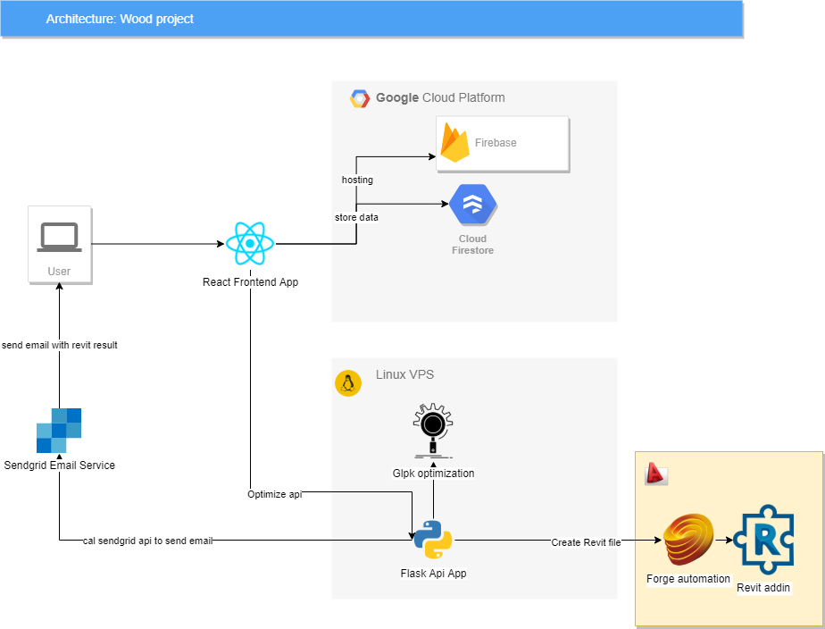

## Intro
This is a project frontend to draw the floor plan and run the optimization
This project was bootstrapped with [Create React App](https://github.com/facebook/create-react-app).

## Architecture
(./architecture)

## Available Scripts

In the project directory, you can run:

### `npm start`

Runs the app in the development mode.<br>
Open [http://localhost:3000](http://localhost:3000) to view it in the browser.

The page will reload if you make edits.<br>
You will also see any lint errors in the console.

### `npm test`

Launches the test runner in the interactive watch mode.<br>
See the section about [running tests](https://facebook.github.io/create-react-app/docs/running-tests) for more information.

### `npm run build`

Change your .env.production file to correct api endpoint
Builds the app for production to the `build` folder.<br>
It correctly bundles React in production mode and optimizes the build for the best performance.

The build is minified and the filenames include the hashes.<br>
Your app is ready to be deployed!


### Deployment

The application is a SPA application hosting on firebase (or any other hosting). The data is stored in the Google Firestore
We can deploy with firebase hosting by the command
```bash
firebase login
firebase deploy
```
This section has moved here: https://firebase.google.com/docs/hosting


### Developer Mode
Go to the firestore console and add isDeveloper to the user, then you can export and import projects by userId and projectId#


### Dependencies
- <a href="https://reactjs.org/" target="_blank">Reactjs</a>
- <a href="https://cvdlab.github.io/react-planner/" target="_blank">React Planner</a>
- <a href="https://chrvadala.github.io/react-svg-pan-zoom/?path=/story/welcome--page" target="_blank">react-svg-pan-zoom</a>
- <a href="https://redux.js.org/" target="_blank">Redux</a>
- <a href="https://redux-saga.js.org/" target="_blank">Redux Saga</a>
- <a href="https://redux-saga-firebase.js.org/" target="_blank">Redux Saga Firebase</a>


